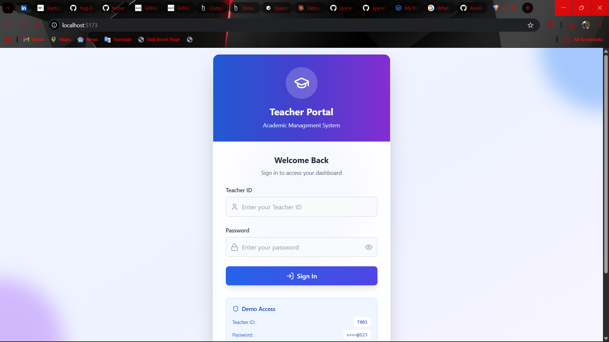
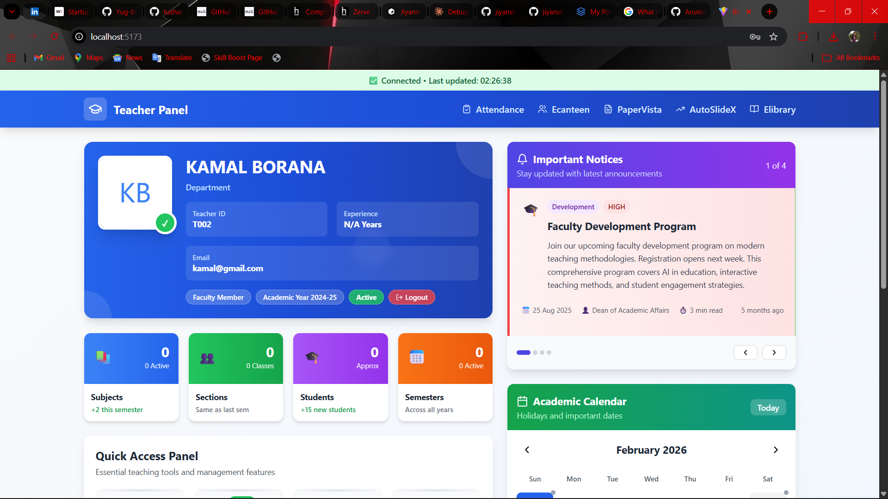
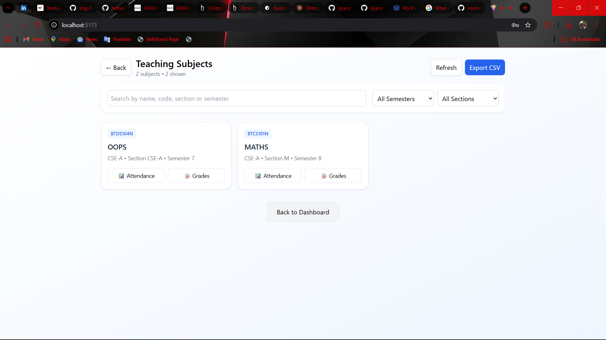

# Teacher Panel

A comprehensive React + TypeScript teacher management and attendance tracking system with facial recognition integration. This panel enables teachers to manage their profile, track student attendance, handle grades, and access course materials.

## 📋 Features

### Core Functionalities
- **Teacher Authentication**: Secure login with Supabase authentication
- **Password Management**: Forced password reset on first login
- **Profile Management**: View and update teacher profile information
- **Attendance Tracking**: Real-time facial recognition-based attendance marking
- **Grade Management**: View and manage student grades
- **Academic Calendar**: Track important dates and events
- **Subject Management**: Manage teaching subjects and classes
- **Student Roster**: View detailed student information
- **Quick Access Panel**: Quick links to related applications
- **Recent Activity**: Monitor recent actions and updates

### Advanced Features
- **Facial Recognition Integration**: Mark attendance using facial recognition
- **Session Management**: Create and manage attendance sessions
- **Backend Health Monitoring**: Check connection status to backend
- **Responsive Design**: Works on desktop and tablet devices
- **Real-time Data**: Live student recognition and attendance updates

## 🛠️ Technology Stack

- **Frontend Framework**: React 18.3.1
- **Language**: TypeScript 5.5.3
- **Build Tool**: Vite 5.4.2
- **Styling**: Tailwind CSS 3.4.1
- **Animation**: Framer Motion 12.23.12
- **Backend**: Supabase (Authentication + Database)
- **Icons**: Lucide React 0.344.0
- **Security**: bcryptjs 3.0.2
- **Linting**: ESLint 9.9.1

## 📦 Installation

### Prerequisites
- Node.js 16+ installed
- npm or yarn package manager
- Supabase account and project
- Python backend running (for facial recognition)
- ngrok installed and configured

### Steps

1. **Install dependencies**:
   ```bash
   npm install
   ```

2. **Configure Environment Variables**:
   Create a `.env` file in the root directory:
   ```env
   VITE_SUPABASE_URL=your_supabase_url
   VITE_SUPABASE_ANON_KEY=your_supabase_anon_key
   ```

3. **Configure Backend API**:
   - The application communicates with a Python backend via ngrok tunneling
   - Backend URL is configured in `src/components/AttendancePage.tsx`

## 🚀 Development

### Start Development Server
```bash
npm run dev
```
The application will run on `http://localhost:5173` by default.

### Build for Production
```bash
npm run build
```
Output files are generated in the `dist/` directory.

### Preview Production Build
```bash
npm run preview
```

### Lint Code
```bash
npm run lint
```
Lint and fix issues:
```bash
npm run lint -- --fix
```

## 🔗 Backend API Integration

### Updating Ngrok Link

The teacher panel connects to a Python backend through ngrok tunneling for facial recognition features. When your ngrok session expires or you get a new tunnel, follow these steps:

#### Update `AttendancePage.tsx`
- **File**: `src/components/AttendancePage.tsx`
- **Line**: 51
- **Current**: `const API_BASE = 'https://a8066c847fbb.ngrok-free.app';`
- **Update To**: Replace with your new ngrok URL
  ```typescript
  const API_BASE = 'https://YOUR_NEW_NGROK_URL';
  ```

### Finding Your Ngrok URL

1. Start ngrok on your backend (Python) server:
   ```bash
   ngrok http 8000  # or your backend port
   ```

2. Look for the "Forwarding" URL in the terminal output:
   ```
   Forwarding                    https://XXXXXXXXXXXXX.ngrok-free.app -> http://localhost:8000
   ```

3. Copy the HTTPS URL (the one starting with `https://`) and update the `API_BASE` value

### API Endpoints Used

- **Attendance Operations**:
  - `POST /attendance/start-session` - Start an attendance session
  - `POST /attendance/mark-attendance` - Mark attendance
  - `POST /attendance/end-session` - End attendance session
  - `GET /attendance/sessions` - Get attendance sessions
  - `GET /debug/students` - Debug endpoint to check backend connection

- **Recognition Operations**:
  - `POST /recognize` - Perform facial recognition
  - `GET /recognize/status` - Check recognition status

## � Screenshots

### Teacher Panel Interface
| Auth Page | Home Dashboard |
|-----------|----------------|
|  |  |

| Subject Management | Attendance Tracking |
|-------------------|-------------------|
|  |  |

## 📝 Project Structure

```
teacher-panel/
├── src/
│   ├── components/
│   │   ├── AttendancePage.tsx      # Attendance tracking and facial recognition
│   │   ├── GradesPage.tsx          # Grade management
│   │   ├── SubjectsPage.tsx        # Subject management
│   │   ├── TeacherPanel.tsx        # Main panel dashboard
│   │   ├── LoginPage.tsx           # Authentication
│   │   ├── PasswordResetModal.tsx  # Password reset
│   │   ├── ProfileHeader.tsx       # Profile display
│   │   ├── StatsGrid.tsx           # Statistics display
│   │   ├── QuickAccessPanel.tsx    # Quick links
│   │   ├── RecentActivity.tsx      # Activity log
│   │   ├── AcademicCalendar.tsx    # Calendar view
│   │   ├── NoticesCarousel.tsx     # Notice display
│   │   └── SubjectsList.tsx        # Subjects listing
│   ├── lib/
│   │   └── supabase.ts             # Supabase configuration
│   ├── utils/                      # Utility functions
│   ├── types/                      # TypeScript types
│   ├── App.tsx                     # Main application component
│   ├── main.tsx                    # Application entry point
│   ├── vite-env.d.ts               # Vite environment types
│   └── index.css                   # Global styles
├── public/                         # Static files
├── images/                         # Screenshot images
├── index.html                      # HTML template
├── vite.config.ts                 # Vite configuration
├── tailwind.config.js             # Tailwind CSS configuration
├── postcss.config.js              # PostCSS configuration
├── eslint.config.js               # ESLint configuration
├── tsconfig.json                  # TypeScript configuration
└── package.json                   # Project dependencies
```

## 🔐 Authentication

The panel uses Supabase for authentication. Teachers must:

1. Log in with their credentials
2. Complete password reset if required (on first login)
3. Session is stored locally in browser

### Login Flow
- Teacher enters email and password
- System validates against Supabase
- If `must_reset` flag is true, password reset modal appears
- On success, teacher data is loaded and session is created

## 🎥 Attendance Marking with Facial Recognition

### How It Works
1. Teacher selects attendance mode (Student or Self)
2. Chooses subject, section, and semester
3. Starts an attendance session
4. Camera captures frames every 500ms
5. Frames are sent to Python backend for facial recognition
6. Recognized students are marked present automatically
7. Session can be ended to finalize attendance

### Requirements
- Working camera/webcab on device
- Good lighting conditions
- Clear view of faces
- Backend facial recognition models trained

## 🐛 Troubleshooting

### Ngrok Connection Issues
- Verify ngrok URL is correct and recently generated
- Check that the backend server is running
- Ensure ngrok tunnel is active (should show "online" status)
- Look for connection status indicator in Attendance page

### Authentication Issues
- Verify Supabase credentials in `.env` file
- Check Supabase project is active
- Clear browser cookies if session persists incorrectly
- Ensure email exists in teacher database

### Camera Issues
- Check browser permissions for camera access
- Close other applications using the camera
- Restart the browser if camera isn't detected
- Ensure camera is enabled in device settings

### Facial Recognition Not Working
- Verify backend is connected (check status indicator)
- Ensure faces are clearly visible in camera frame
- Check that students have been trained in admin-panel
- Review backend logs for recognition errors
- Test with the `/debug/students` endpoint

### Build Issues
- Delete `node_modules` and `package-lock.json`, then run `npm install`
- Clear Vite cache with `npm run build -- --force`
- Check TypeScript errors with `npx tsc --noEmit`

## 📚 Related Components

### 🏫 NEURO CAMPUS - Campus Management System
The complete campus ecosystem with multiple modules:

| E-Canteen | E-Library | QR Code |
|-----------|-----------|---------|
|  |  |  |

**📌 Access NEURO CAMPUS**: [https://neuro-campus-73w8.vercel.app/](https://neuro-campus-73w8.vercel.app/)

### 📄 PaperVista - Smart Exam Paper Generator
AI-powered question paper and exam creation system:

| Overview | Exam Type Selection |
|----------|-------------------|
|  |  |

| Paper Preview | Topic Management |
|--------------|-----------------||
|  |  |

**📌 Access PaperVista**: Check deployment for live link

### 🎪 AutoSlideX - Presentation Generator
Automated PowerPoint generation from text and PDFs:

| Home Interface | New Slide |
|----------------|----------|
|  |  |

| Final PPT | Preview | Download |
|-----------|---------|----------|
|  |  |  |

**📌 Access AutoSlideX**: Check deployment for live link

## 📚 Related Documentation

- Admin Panel: See `../Admin-panel/` for admin interface
- Backend API: See `../backend/README.md` for Python backend setup
- Smart Career Guidance: See `../Smart Career Guidance System/` for related system

## 🤝 Contributing

1. Create a new branch for your feature
2. Make your changes with TypeScript best practices
3. Run linting: `npm run lint -- --fix`
4. Test thoroughly on multiple browsers
5. Submit a pull request with clear description

## 📄 License

This project is part of the Major Project portfolio.

## ⚙️ Environment Setup

### Required Environment Variables
```env
# Supabase Configuration
VITE_SUPABASE_URL=https://your-project.supabase.co
VITE_SUPABASE_ANON_KEY=your_anon_key_here
```

### Development Environment
- Node.js 16 or higher
- npm or yarn package manager
- A modern web browser (Chrome, Firefox, Safari, Edge)
- Python backend running locally or remotely

## 🔐 Security Notes

- Never commit `.env` files with real credentials to version control
- Regenerate ngrok URLs periodically for security
- Use environment variables for all sensitive configuration
- Validate all user inputs on both frontend and backend
- Keep dependencies updated: `npm audit` and `npm update`
- Use HTTPS in production (ngrok provides HTTPS tunneling)

## 📊 Database Schema

The application uses Supabase with the following main tables:
- `teachers` - Teacher information and credentials
- `subjects` - Course subjects
- `students` - Student information
- `attendance_sessions` - Attendance session records
- `attendance_records` - Individual attendance marks
- `grades` - Student grades

## 🚢 Deployment

### Vercel Deployment
The panel is currently deployed on Vercel at: `https://teacher-panel-chi.vercel.app/`

For production deployment:
1. Build the project: `npm run build`
2. Deploy to Vercel: `vercel deploy`
3. Set environment variables in Vercel dashboard
4. Ensure backend ngrok URL is accessible from production

### Environment Setup for Production
- Update `API_BASE` for production backend URL
- Configure CORS headers on backend
- Use persistent backend (not local ngrok)
- Enable HTTPS for all communications

## 📞 Support

For issues or questions:
1. Check troubleshooting section above
2. Review browser console for errors (F12)
3. Check network requests in DevTools
4. Verify backend connectivity
5. Contact development team if needed
